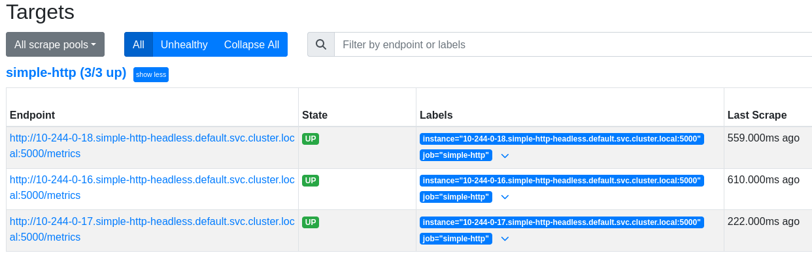
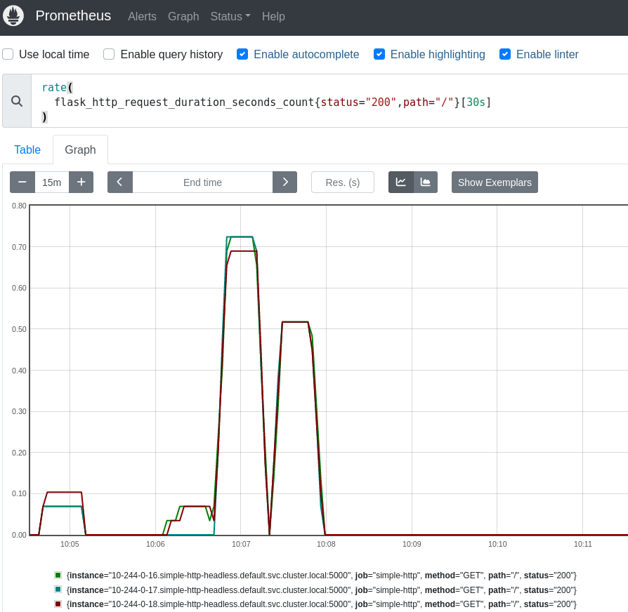

# simple-http
An example of simple HTTP service k8s deployment with Prometheus metrics.

Service listens for HTTP GET requests and responds with timestamp and hostname.

## How to build
### Local Docker image registry
If you use single-node k8s, e.g. **minikube** or **k3s controlplane only**, you can store image in the local Docker image registry. 
#### minikube
```shell
$ minikube image build -t simple-http <project-dir>
```
#### k3s
```bash
$ docker build -t simple-http <project-dir>
```
Start k3s with `--docker` flag to use local node Docker.


### Private Docker image registry
```bash
$ docker build -t <your-registry>/simple-http <project-dir>
```
Upload image to your registry.

Change image name in simple-http deployment:
```yaml
spec:
  containers:
  - name: simple-http
    image: <your-registry>/simple-http
```
Add registry secret according to the [instruction](https://kubernetes.io/docs/tasks/configure-pod-container/pull-image-private-registry/).

## How to deploy
[Configure](https://kubernetes.io/docs/concepts/configuration/organize-cluster-access-kubeconfig/) kubectl config file to access your cluster.

Make sure you have ingress controller installed/enabled. For **minikube**:
```shell
$ minikube addons enable ingress
```
Create objects via command:
```shell
$ kubectl apply -f <project-dir>/deployment.yaml
```
List Ingress objects:
```shell
$ kubectl get ing
NAME           CLASS   HOSTS   ADDRESS        PORTS   AGE
http-ingress   nginx   *       <ingress-ip>   80      <>m 
```

Access service at `http://<ingress-ip>`

Access Prometheus web interface at `http://<ingress-ip>/prometheus`

## How to use metrics

Under **Status/Targets** you can check health of target pods.



Under **Graph** tab you can input the expression and choose Table or Graph data representation. 



You can query metrics generated by pods running the Flask app using [query language](https://prometheus.io/docs/prometheus/latest/querying/basics/).

## Examples
### Memory usage
Memory usage of the Flask app, per instance:
```shell
process_resident_memory_bytes{job="simple-http"}
```
### Average response time [30s]
The average response time measured over 30 seconds intervals for successful requests.
```shell
rate(
  flask_http_request_duration_seconds_sum{status="200", path="/"}[30s]
)
 /
rate(
  flask_http_request_duration_seconds_count{status="200", path="/"}[30s]
)
```
### Total number of requests
Number of all HTTP requests for all instances
```shell
sum(flask_http_request_total{job="simple-http"})
```

More examples can be found [here](https://github.com/rycus86/prometheus_flask_exporter/blob/master/examples/sample-signals/README.md)